# Z-RWA: MANTRA Chain Compliance Layer


> **A privacy-preserving RWA Tokenization engine built natively for MANTRA using CosmWasm. It enables institutional compliance (KYC/AML) without revealing trade sizes.**

## 🎯 Introduction

**Z-RWA** bridges the gap between institutional finance and blockchain by solving the privacy-compliance paradox. Traditional RWA tokenization requires exposing sensitive financial data (bank statements, government IDs, trade sizes) to prove regulatory compliance. This is unacceptable for institutional investors managing trillions in assets.

Our solution leverages **Zero-Knowledge Proofs** to verify compliance criteria locally, then submits only cryptographic proofs to MANTRA Chain. This enables:
- ✅ **KYC/AML Compliance** without exposing PII
- ✅ **Qualified Investor Verification** without revealing financial details
- ✅ **Trade Privacy** while maintaining regulatory auditability

## 🏗️ Architecture

Z-RWA consists of two primary components working in tandem:

### Smart Contract Layer

**Technology**: CosmWasm on MANTRA Chain

The smart contract layer handles:
- **ZK Proof Verification**: On-chain verification is performed using a Groth16 Verifier contract generated via SP1
- **Asset Issuance**: Minting RWA tokens via MANTRA Token Service (MTS)
- **Compliance Gating**: Integrating with MANTRA DID for identity verification
- **Lifecycle Management**: Transfer restrictions, burn mechanisms, and regulatory hooks

**Key Contracts**:
- `custom-marker`: Core RWA token with compliance rules
- `treasury-bond`: Institutional debt instruments
- `fund`: Tokenized investment fund shares
- `interop-core`: Cross-chain settlement bridge

### ZK Circuits Layer: `circuits/compliance-proofs`

**Technology**: SP1 ZK-VM (Rust-based Zero-Knowledge Virtual Machine)

The circuits layer generates compliance proofs:
- **Local Document Ingestion**: Parse sensitive PDFs (tax returns, bank statements) locally
- **AI-Driven Verification**: RAG (Retrieval Augmented Generation) extracts compliance criteria
- **ZK Proof Generation**: SP1 VM produces Groth16 proofs of compliance
- **Privacy Preservation**: Original documents never leave user's machine

**Flow**:

```mermaid
graph LR
    subgraph "Off-Chain (User's Machine)"
        Docs[📄 Sensitive Documents] --> RAG[🔐 ZK-RAG Engine]
        RAG --> Proof[✅ Groth16 Proof]
    end
    
    subgraph "MANTRA Chain"
        Proof --> Verifier[📝 CosmWasm Verifier]
        Verifier --> DID[🆔 MANTRA DID Check]
        DID --> MTS[🪙 Token Minting]
    end
    
    MTS --> Token[💎 RWA Token]
```


## 🌟 Why MANTRA?

MANTRA Chain is uniquely positioned for institutional RWA adoption:

1. **VARA Licensing**: MANTRA's regulatory framework in Dubai provides legal clarity for tokenized assets
2. **Native DID Module**: Decentralized Identity integration ensures only KYC'd users can interact with RWA contracts
3. **Compliance Module**: Built-in regulatory hooks for transfer restrictions and whitelisting
4. **Token Service (MTS)**: Standardized asset lifecycle management for regulated securities
5. **Institutional Focus**: Purpose-built for real-world asset settlements, not DeFi speculation

**Z-RWA leverages these primitives** to create a complete privacy-preserving compliance stack that meets institutional requirements while maintaining blockchain transparency.

## 📂 Repository Structure

```
Mantra-RWA-Compliance/
├── contracts/
│   ├── verifier/                 # SP1 Groth16 ZK Verifier (On-Chain)
│   │   ├── src/
│   │   │   ├── contract.rs       # SP1 proof verification logic
│   │   │   ├── msg.rs            # Message types
│   │   │   └── state.rs          # State management
│   │   └── Cargo.toml
│   └── mantra-rwa-core/          # RWA token contracts
│       ├── contracts/
│       │   ├── custom-marker/    # Core RWA token contract
│       │   ├── treasury-bond/    # Debt instrument contract
│       │   ├── fund/             # Investment fund contract
│       │   └── interop-core/     # Cross-chain bridge
│       └── README.md
├── circuits/
│   └── compliance-proofs/        # SP1 ZK Proof Generation (Off-Chain)
│       ├── crates/
│       │   ├── circuits/         # Guest program (RISC-V)
│       │   ├── mantra-script/    # Proof generation script
│       │   ├── core/             # ZK proof logic
│       │   └── ingestion/        # Document parsing & RAG
│       └── README.md
├── scripts/
│   ├── build_contract.sh         # CosmWasm optimizer build script
│   └── run_demo_flow.sh          # End-to-end proof generation demo
└── artifacts/
    └── verifier.wasm             # Compiled ZK verifier contract
```

## 🚀 Quick Start

### Prerequisites

- **Rust**: Install via [rustup](https://rustup.rs/)
- **Docker**: For reproducible CosmWasm builds
- **MANTRA Chain**: `mantrachaind` CLI ([installation guide](https://docs.mantrachain.io))
- **SP1** (optional): Only needed for fresh proof generation ([SP1 docs](https://docs.succinct.xyz))

### 1. Run the Demo (Fast - For Grant Reviewers)

The demo uses a **pre-computed ZK proof** by default for instant execution:

```bash
# Quick demo (uses cached proof, ~10 seconds)
./scripts/run_demo_flow.sh
```

This will:
- ✅ Build the verifier contract to wasm32 (201KB)
- ✅ Load a pre-computed SP1 Groth16 proof
- ✅ Display deployment instructions

**For full proof generation** (10-30 minutes):
```bash
./scripts/run_demo_flow.sh --generate
```

### 2. Build Smart Contracts (Optional)

```bash
# Build optimized WASM binaries using Docker
./scripts/build_contract.sh
```

This produces optimized `.wasm` files in `contracts/mantra-rwa-core/artifacts/`.

### 3. Generate Fresh Compliance Proof (Optional)

```bash
# Navigate to circuits directory
cd circuits/compliance-proofs

# Ingest your private documents (local only)
cargo run -p private-context-ingestion -- ingest /path/to/tax_return.pdf

# Generate ZK proof of "Qualified Investor" status
cargo run -p private-context-ingestion -- prove "Accredited Investor" --threshold 0.7
```

### 3. Deploy to MANTRA Testnet

```bash
# Store contract on-chain
mantrachaind tx wasm store contracts/mantra-rwa-core/artifacts/custom_marker.wasm \
  --from wallet --gas auto --gas-adjustment 1.3

# Instantiate with your proof
mantrachaind tx wasm instantiate <CODE_ID> \
  '{"proof": "<YOUR_ZK_PROOF>", "did": "<YOUR_MANTRA_DID>"}' \
  --from wallet --label "Z-RWA Token"
```

## 🗺️ Roadmap

| Phase | Deliverable | Status |
|-------|-------------|--------|
| **Phase 1** | Real ZK Architecture (SP1 Groth16 Verifier + Proof Generation) | ✅ Completed |
| **Phase 2** | Testnet MVP (Contract Ready for MANTRA Deployment) | ✅ Completed |
| **Phase 3** | MTS Integration (Full Asset Lifecycle) | 📅 Q1 2026 |
| **Phase 4** | Mainnet Launch (Security Audit + Production UI) | 📅 Q2 2026 |

## 📚 Documentation

- **[Smart Contracts README](contracts/mantra-rwa-core/README.md)**: Contract architecture and deployment
- **[ZK Circuits README](circuits/compliance-proofs/README.md)**: Proof generation and privacy model
- **[System Flow](contracts/mantra-rwa-core/SYSTEM_FLOW.md)**: End-to-end technical flow

## 🤝 Contributing

This project is being developed as part of the MANTRA Chain Grant Program. Contributions are welcome! Please ensure:
- All contracts pass `cargo test`
- ZK circuits maintain privacy guarantees
- Code follows CosmWasm best practices

## 📄 License

Apache 2.0

---

**Built with ❤️ for the MANTRA Ecosystem**
