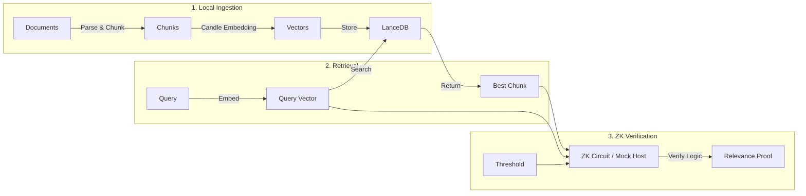

# Private Context Awareness (ZK-RAG)

A privacy-first RAG system that ingests, secures, and verifies personal data locally. It allows users to prove the relevance of their private documents to a query using Zero-Knowledge proofs, without revealing the document content.

## 🔄 System Flow

The system operates in three main stages: Ingestion, Retrieval, and Verification.



## 🚀 Quick Start

### Prerequisites
- **Rust**: [Install Rust](https://www.rust-lang.org/tools/install)
- **Models**: Ensure `all-MiniLM-L6-v2` is in `./models/`.

### 1. Ingest Data
Parse a text file, chunk it, and store embeddings locally.
```bash
# From workspace root
cargo run -p private-context-ingestion -- ingest private-context/example.txt
```
*Stores vectors in `./data/lancedb`.*

### 2. Search Context
Retrieve the most relevant chunk for a query.
```bash
cargo run -p private-context-ingestion -- search "Privacy"
```

### 3. Generate Proof (ZK-RAG)
Verify that you hold a relevant document for a query without revealing it.
```bash
# Runs in Mock Mode (Host CPU) if SP1 toolchain is missing
cargo run -p private-context-ingestion -- prove "Privacy" --threshold 0.4
```
**Output:**
```
✅ Proof Valid: Chunk is relevant.
```

## 📚 Documentation
- **[Usage Guide](file:///home/user/.gemini/antigravity/brain/af33fbe7-61ca-45cb-8a9b-18551079f5a7/usage_guide.md)**: Detailed command reference.
- **[Technical Architecture](file:///home/user/.gemini/antigravity/brain/af33fbe7-61ca-45cb-8a9b-18551079f5a7/technical_architecture.md)**: Deep dive into components and design.
- **[Changelog](file:///home/user/.gemini/antigravity/brain/af33fbe7-61ca-45cb-8a9b-18551079f5a7/CHANGELOG.md)**: Release history.

## 🏛️ MANTRA Chain Integration

### Compliance Narrative (ZK-RAG)
This project enables **Institutional RWA Adoption** by solving the privacy-compliance paradox:
- **Challenge**: Financial regulations (KYC/AML) require proving "Qualified Investor" status, usually involving sensitive PII (Aadhaar, PAN, Tax Returns).
- **Solution**: Users run **ZK-RAG** locally to generate a Zero-Knowledge Proof that their documents meet the "Accreditation Level" criteria without revealing the documents themselves.
- **On-Chain**: The MANTRA Chain contract verifies this proof along with the **DID (Decentralized Identity)** of the sender. The contract mints RWA tokens ONLY if the geometric proof of qualification is valid and the user's DID is compliant.

### MANTRA Synergy
We leverage MANTRA's **VARA-licensed infrastructure** for legal and technical finality:
1.  **MANTRA Compliance Module**: Acts as the "Gatekeeper", ensuring only KYC'd DIDs can attempt the ZK verification.
2.  **MANTRA Token Service (MTS)**: Upon successful ZK verification, the contract triggers MTS to mint legally recognized asset tokens.
3.  **Audit Trail**: The contract stores a cryptographic link (Proof Hash) to the private execution, giving regulators a verifiable paper trail without handling the private data.
