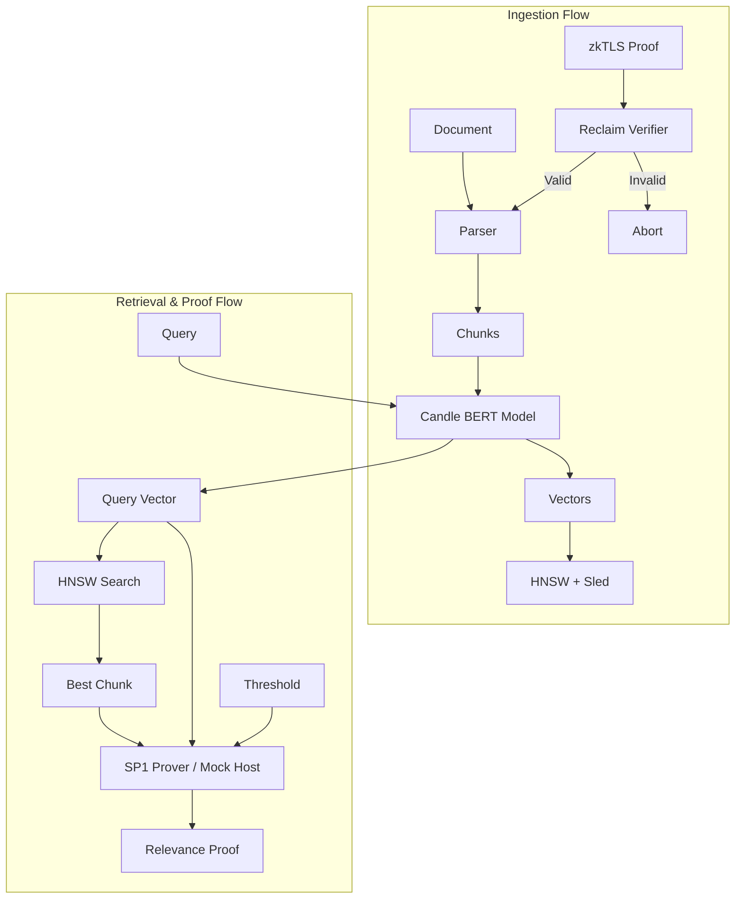

# Technical Architecture: Private Context Awareness

## 1. Overview
**Private Context Awareness** is a privacy-first system designed to ingest, secure, and privately verify personal data (Private Context) for use in AI applications. It ensures that data used for RAG (Retrieval-Augmented Generation) is not only stored locally but also cryptographically verified for provenance and relevance without revealing the raw data itself.

## 2. System Architecture

The system is built on three core pillars:
1.  **Local Ingestion Engine**: A pure-Rust stack for parsing, embedding, and storing documents locally.
2.  **zkTLS Data Provenance**: Integration with Reclaim Protocol to verify the origin of data before ingestion.
3.  **ZK-RAG Verification**: A Zero-Knowledge circuit (using SP1) to prove the relevance of a retrieved document to a query without adhering the raw content.

## 3. Component Details

### 3.1 Local Ingestion Engine
*   **Purpose**: Processes and stores data completely offline to ensure privacy.
*   **Key Libraries**:
    *   `candle`: For running BERT embedding models locally.
    *   `hnsw_rs`: For efficient approximate nearest neighbor search.
    *   `sled`: For persistent key-value storage of document metadata.
    *   `text-splitter`: For semantic chunking of documents.
*   **Design**: The system avoids complex external databases (like Postgres or LanceDB) in favor of a lightweight, embedded Rust solution.

### 3.2 Data Provenance (zkTLS)
*   **Purpose**: Ensures that ingested information is authentic (e.g., proving a bank statement came from a specific bank URL).
*   **Implementation**:
    *   **Reclaim Protocol**: Uses the `reclaim-rust-sdk` to verify cryptographic proofs generated by the Reclaim app/extension.
    *   **Gatekeeper Logic**: The `ingest` command strictly enforces proof validation. If a proof is provided but fails verification, the entire ingestion process is aborted.
    *   **Metadata**: Validated proofs are linked to document chunks via `proof_id` and `provider` fields, creating an immutable chain of custody.

### 3.3 Zero-Knowledge Verification (ZK-RAG)
*   **Purpose**: Allows a user to prove to a third party (or an on-chain contract) that they possess a document relevant to a query, without revealing the document text or the query vector.
*   **Implementation**:
    *   **SP1 (Succinct)**: A RISC-V based Zero-Knowledge Virtual Machine (ZKVM).
    *   **Fixed-Point Math**: Floating-point arithmetic is expensive and non-deterministic in ZK circuits. We implemented a custom `math` module using `fixed::types::I32F32` to perform Dot Product and Cosine Similarity operations deterministically.
    *   **Guest Program**: A minimal Rust binary (`crates/circuits`) that accepts two vectors and a threshold, computes their similarity, and commits the boolean result.
    *   **Mock Mode**: In environments without the full SP1 toolchain (like this workspace), the CLI falls back to executing the exact same fixed-point logic on the host CPU for functional verification.

## 4. Workflows

### 4.1 Ingestion
1.  **Input**: User provides a text file (`test.txt`) and an optional Reclaim proof (`proof.json`).
2.  **Verification**: If a proof is present, the CLI verifies the digital signature against the Reclaim registry.
3.  **Parsing**: The file is split into chunks (default 500 chars).
4.  **Embedding**: The `all-MiniLM-L6-v2` model generates a 384-dimensional vector for each chunk.
5.  **Storage**: Vectors are indexed in HNSW; content and provenance metadata are stored in Sled.

### 4.2 Proving Relevance
1.  **Input**: User provides a query string (e.g., "Rust storage").
2.  **Search**: The system finds the most relevant document chunk in the local store.
3.  **Circuit Execution**:
    *   **Inputs**: Query Vector (Private), Chunk Vector (Private), Threshold (Public, e.g., 0.7).
    *   **Computation**: `similarity = dot(q, c) / (|q| * |c|)`.
    *   **Assertion**: Check if `similarity >= threshold`.
4.  **Output**: A ZK proof attesting that "I have a document with similarity X >= threshold". (Or a console log in Mock Mode).
