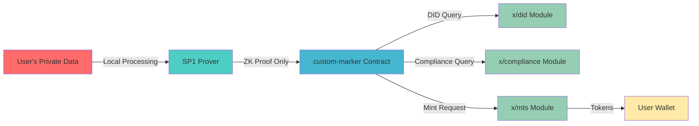

# Z-RWA Protocol: Contract Architecture & End-to-End Flow

This document details the technical architecture of the Z-RWA protocol, the roles of specific CosmWasm contracts in the repository, and the lifecycle of a privacy-preserving asset tokenization event.

---

## 1. Contract Ecosystem Overview

The Z-RWA protocol is composed of modular contracts designed for specific asset types and interoperability.

### Core Infrastructure

* **`factory`**: The master orchestration contract. It is responsible for instantiating new RWA tokens (markers), managing protocol fees, and maintaining a registry of verified asset issuers.

* **`custom-marker`**: The primary implementation of the Z-RWA logic. This contract extends standard token functionality with **ZK-Proof Verification**, **DID Checks**, and **MTS (MANTRA Token Service)** hooks.

* **`cw20-marker` & `cw20-token-contract`**: Standard CosmWasm implementations used for assets that do not require the full `custom-marker` compliance overhead or for wrapping existing tokens.

* **`price-feed`**: An on-chain oracle adapter that provides real-time asset valuations (NAV) to the `fund` and `treasury-bond` contracts.

### Asset-Specific Implementations

* **`treasury-bond`**: A specialized contract for handling debt instruments. It manages coupon schedules, maturity dates, and yield distribution to token holders while preserving holder anonymity.

* **`fund`**: Implements logic for private investment funds. It handles subscription/redemption cycles and calculates Net Asset Value (NAV) dynamically based on the `price-feed`.

* **`jpmc`**: A bespoke adapter contract designed for specific institutional pilot flows (e.g., bank-specific settlement logic).

### Cross-Chain Interoperability

* **`interop-core`**: Manages the state of cross-chain asset transfers and communicates with the underlying bridge routers.

* **`interop-multisig`**: Provides governance security for cross-chain operations, requiring multi-party approval for sensitive bridge transactions.

* **`axelar-router`**: The gateway contract for Axelar Network integration, enabling Z-RWA assets to be bridged to/from other Cosmos chains and EVM networks securely.

---

## 2. End-to-End Asset Tokenization Flow

The following sequence describes the core lifecycle of minting a compliant, privacy-preserved RWA token using the `custom-marker` contract.

### Sequence Diagram

```mermaid
sequenceDiagram
    participant User as User (Off-Chain)
    participant Prover as SP1 Prover (Local)
    participant Contract as Z-RWA Contract (custom-marker)
    participant DID as MANTRA x/did
    participant Compliance as MANTRA x/compliance
    participant MTS as MANTRA x/mts

    Note over User, Prover: Local Privacy Realm
    User->>Prover: 1. Ingest Private Docs (Bank Stmt, ID)
    Prover->>Prover: 2. Generate Groth16 Proof (Compliance)
    Prover-->>User: 3. Return Proof & Public Inputs

    Note over User, MTS: On-Chain Public Realm
    User->>Contract: 4. ExecuteMsg::VerifyAndMint { proof, amount }
    
    rect rgb(20, 20, 20)
        note right of Contract: Step 1: ZK Verification
        Contract->>Contract: Verify Groth16 Proof
    end

    rect rgb(30, 30, 30)
        note right of Contract: Step 2: Identity Check
        Contract->>DID: Query: Is DID active?
        DID-->>Contract: Yes (Active)
    end

    rect rgb(40, 40, 40)
        note right of Contract: Step 3: Compliance Check
        Contract->>Compliance: Query: KYC Status / Sanctions?
        Compliance-->>Contract: Verified / Clear
    end

    rect rgb(50, 50, 50)
        note right of Contract: Step 4: Asset Minting
        Contract->>MTS: MsgMint { recipient, amount }
        MTS-->>Contract: Tokens Minted
    end

    Contract->>Contract: Step 5: Store Audit Record
    Contract-->>User: Transaction Success
```



---

## 3. Step-by-Step Technical Explanation

The `custom-marker` contract executes the following atomic flow for every minting request. If any step fails, the entire transaction reverts.

### Step 1: ZK Proof Verification (Groth16)

**Action:** The contract receives the binary `proof` and `public_inputs` (e.g., document hash, threshold requirements).

**Logic:** It calls the embedded CosmWasm Groth16 verifier to strictly validate that the proof was generated by the specific `verification_key` associated with the RWA's compliance circuit.

**Code Reference:** `verify_proof(proof, public_inputs, vk)`

### Step 2: Identity Check (x/did)

**Action:** The contract validates the `user_did` provided in the transaction.

**Integration:** It queries the MANTRA Chain `x/did` module.

**Check:** Ensures the DID exists, is not revoked, and matches the sender of the transaction.

**Code Reference:** `deps.querier.query(&DIDQuery::GetDID { ... })`

### Step 3: Compliance Check (x/compliance)

**Action:** The contract verifies the regulatory standing of the user.

**Integration:** It queries the MANTRA Chain `x/compliance` module.

**Check:**
- **KYC Status:** Confirms the user has a valid KYC flag (linked to their DID).
- **Sanctions:** Checks if the address/DID is on any blocked lists.
- **Jurisdiction:** Validates that the user resides in a permitted jurisdiction for this specific asset.

**Code Reference:** `check_compliance(deps, user_did)`

### Step 4: Asset Minting (x/mts)

**Action:** Once all checks pass, the contract authorizes the minting of tokens.

**Integration:** It constructs and sends a `MsgMint` to the MANTRA Token Service (`x/mts`).

**Result:** The MTS module creates the native RWA tokens and transfers them to the user's wallet.

**Code Reference:** `CosmosMsg::Custom(MtsMsg::Mint { ... })`

### Step 5: Audit Trail

**Action:** For regulatory reporting, the transaction must be auditable.

**Logic:** The contract stores an immutable `AuditRecord` in its local state.

**Data:** Includes the `proof_hash`, `timestamp`, `user_did` (pseudonymous), and `minted_amount`.

**Privacy:** The record proves that a compliant check happened, without revealing what the underlying private data was.

---

## 4. Security Guarantees

The Z-RWA protocol is architected on a **"Privacy-by-Default"** principle using **Client-Side Proving**.

### Zero Data Leakage

Sensitive documents (Tax Returns, Bank Statements, Government IDs) are processed entirely on the **User's Local Machine** (via the SP1 Prover). They are **never uploaded** to any server, IPFS, or blockchain node.

### Cryptographic Truth

The on-chain contract only receives a **Zero-Knowledge Proof**. This proof cryptographically asserts that *"The data exists and satisfies the rules"* without revealing the data itself.

### Sovereign Identity

By integrating with `x/did`, we ensure users own their identity credentials. The protocol validates the **validity** of the credential, not the **content** of the credential.

### Immutable Logic

The `custom-marker` contracts are immutable (or governed by the `interop-multisig`), ensuring that compliance rules cannot be arbitrarily changed to censor users or rug-pull assets.

---

## 5. Contract Directory Structure

```
contracts/mantra-rwa-core/contracts/
├── axelar-router/          # Cross-chain bridge gateway (Axelar)
├── custom-marker/          # Core Z-RWA compliance token
├── cw20-marker/            # Standard CW20 wrapper
├── cw20-token-contract/    # Base CW20 implementation
├── factory/                # Protocol orchestration & registry
├── fund/                   # Private investment fund logic
├── interop-core/           # Cross-chain state management
├── interop-multisig/       # Governance for bridge operations
├── jpmc/                   # Institutional adapter (pilot)
├── price-feed/             # Oracle integration for NAV
└── treasury-bond/          # Debt instrument implementation
```

---

## 6. Integration Points with MANTRA Chain Modules

The Z-RWA protocol leverages native MANTRA Chain modules for compliance and identity:

| Module | Purpose | Integration Point |
|--------|---------|-------------------|
| **x/did** | Decentralized Identity | DID validation in `custom-marker` |
| **x/compliance** | KYC/AML/Sanctions | Regulatory checks before minting |
| **x/mts** | MANTRA Token Service | Native token minting/burning |
| **x/oracle** | Price feeds | NAV calculation for `fund` contract |

---

## 7. Privacy Architecture



**Key Principle:** Private data never leaves the user's device. Only cryptographic proofs are submitted on-chain.

---

## 8. Future Enhancements

### Planned Features
- **Multi-Asset Collateralization:** Enable RWA tokens to be used as collateral in DeFi protocols
- **Automated Compliance Updates:** Dynamic compliance rule updates via governance
- **Cross-Chain Privacy:** Extend ZK verification to bridged assets on EVM chains
- **Institutional Custody Integration:** Direct integration with qualified custodians

### Research Areas
- **Recursive ZK Proofs:** Compress multiple compliance checks into a single proof
- **Private Voting:** Enable token holder governance without revealing holdings
- **Confidential Transfers:** Implement privacy-preserving token transfers using homomorphic encryption

---

## 9. Developer Resources

### Building Contracts
```bash
# Build all contracts
cd contracts/mantra-rwa-core
make build

# Build specific contract
cd contracts/mantra-rwa-core/contracts/custom-marker
cargo wasm
```

### Testing
```bash
# Run unit tests
cargo test

# Run integration tests
./scripts/simulate_full_flow.sh
```

### Deployment
See [DEMO.md](../docs/DEMO.md) for deployment instructions and testnet examples.

---

## 10. License & Compliance

This protocol is designed to be **compliant-by-default** with:
- Securities regulations (Reg D, Reg S)
- AML/KYC requirements (FATF guidelines)
- Data privacy laws (GDPR, CCPA)

**Note:** This is a technical implementation. Legal compliance requires proper legal structuring and regulatory approval in your jurisdiction.
