# Z-RWA: The ZK-Privacy Bridge for MANTRA Chain

> "Empowering institutional RWA tokenization on MANTRA Chain through privacy-preserving ZK-Intelligence (ZK-RAG)."


## 💡 The Problem & Solution

### The Gap
Institutional investors control trillions in assets but cannot deploy them on-chain because financial regulations (KYC/AML) require proving solvency and identity using sensitive data (bank statements, government IDs). Putting this data on a public ledger is a non-starter.

### Our Solution
**Z-RWA** bridges this gap using **ZK-RAG (Retrieval Augmented Generation with Zero-Knowledge)**.
1.  **Local Verification**: Users ingest their private documents locally.
2.  **ZK Proof**: An AI agent running in the **SP1 ZK-VM** verifies the data against regulatory criteria.
3.  **On-Chain Settlement**: Only the cryptographic **Groth16 Proof** is sent to MANTRA Chain, where the contract mints RWA tokens via **MTS**.

## ✨ Key Features

-   🛡️ **ZK-Privacy**: Zero leakage of PII (Personally Identifiable Information). Proofs verify facts, not data.
-   🤖 **AI-Driven Underwriting (RAG)**: Automated, deep due-diligence of complex PDF documents and financial records.
-   🏛️ **MANTRA Native Integration**: Leverages **MANTRA Token Service (MTS)** for compliant asset lifecycle and **MANTRA DID** for identity verification.
-   ⚡ **SP1 Powered**: Built on Succinct's high-performance Rust-based ZK-VM for fast, secure proof generation.

## 🏗️ Technical Architecture

```mermaid
graph LR
    subgraph "Off-Chain Privacy Realm"
        Docs["📄 Sensitive Docs"] --> RAG["🔐 ZK-RAG (SP1)"]
        RAG --> Proof["A. Groth16 Proof"]
    end

    subgraph "MANTRA Chain"
        Proof --> Verifier["📝 CosmWasm Verifier"]
        Verifier --> DID["🆔 MANTRA DID Check"]
        DID --> MTS["🪙 MTS Minting"]
    end

    MTS --> Token["RWA Token"]
```



## 📂 Repository Structure

This Monorepo houses the complete stack for the Z-RWA Bridge:

-   **`Z-RWA/`**: CosmWasm implementation for MANTRA Chain.
    -   `contracts/`: Main contract logic (`mantra-contract`).
-   **`ZK-RAG/`**: The core privacy engine.
    -   `crates/mantra-contract`: (New) ZK-RWA CosmWasm Contract.
    -   `crates/mantra-script`: Prover script using SP1 SDK.
    -   `crates/core`: Core ZK logic.
-   **`programs/`**: (Legacy) Solana compatibility layer.
-   **`scripts/`**: Deployment and local node setup utilities.

## 🚀 Quickstart

Get up and running with a local MANTRA devnet and ZK prover.

### Prerequisites
-   **Rust**: `stable`
-   **MANTRA Chain**: `mantrachaind` installed.
-   **SP1**: `sp1up` installed.

### 1. Setup Local Chain
Initialize a local MANTRA node with test keys.
```bash
./ZK-RWA/scripts/setup_mantra.sh
```

### 2. Generate Proof
Run the prover script to mock a "Qualified Investor" proof.
```bash
cd ZK-RAG
cargo run -p mantra-script
```

### 3. Verify on Contract
Run the integration test to simulate the on-chain handshake.
```bash
cd ZK-RAG
cargo test -p mantra-contract
```

## 🗺️ Roadmap & Grant Milestones

| Milestone | Deliverable | Status |
| :--- | :--- | :--- |
| **Phase 1** | **PoC & Architecture** (Local ZK-RAG + Mock Contract) | ✅ Completed |
| **Phase 2** | **Devnet MVP** (MANTRA Testnet Deployment) | 🚧 In Progress |
| **Phase 3** | **MTS Integration** (Full Lifecycle Asset Management) | 📅 Q1 2026 |
| **Phase 4** | **Mainnet Launch** (Security Audit & Production UI) | 📅 Q2 2026 |

---

*Built with ❤️ for the MANTRA Ecosystem.*
