# ZK-Privacy RWA Bridge: System Flow & Changes

## 🔍 Overview
This document outlines the architecture and operational flow of the newly implemented **ZK-Privacy RWA Bridge** on MANTRA Chain. It connects local privacy-preserving document verification (ZK-RAG) with on-chain compliance and asset minting.

## 🛠 changes Implemented

### 1. CosmWasm Contract (`mantra-contract`)
-   **Location**: `crates/mantra-contract`
-   **Purpose**: Acts as the on-chain gatekeeper for RWA minting.
-   **Key Features**:
    -   `MintRwaAsset`: Endpoint to receive ZK proofs.
    -   **ZK Verification**: Verifies BN254 Groth16 proofs (mocked for 1.5 compliance).
    -   **Compliance Check**: Verifies sender's DID via MANTRA Compliance Module.
    -   **Audit Trail**: Immutable record of `{AssetID -> ProofHash}`.
    -   **MTS Integration**: Auto-triggers MANTRA Token Service to mint tokens upon success.

### 2. ZK Prover Script (`mantra-script`)
-   **Location**: `crates/mantra-script`
-   **Purpose**: Client-side tool to generate proofs.
-   **Key Features**:
    -   Integrates `sp1-sdk` to execute the ZK-RAG Guest program.
    -   Maps private data to public metadata (Jurisdiction: "IN_VARA", Accreditation: "QUALIFIED").
    -   Outputs `Proof` and `PublicInputs` formatted for the CosmWasm contract.

---

## 🌊 System Flow

The following diagram illustrates the lifecycle of an RWA asset minting request:

```mermaid
sequenceDiagram
    participant user as 🏛 Institutional Investor
    participant rag as 🔐 Local ZK-RAG
    participant script as 🦀 Prover Script
    participant chain as ⚛️ MANTRA Chain Contract
    participant did as 🆔 Compliance Module
    participant mts as 🪙 MANTRA Token Service

    Note over user, rag: Off-Chain Privacy Realm

    user->>rag: Ingest Sensitive Docs (Tax/KYC)
    rag->>rag: Generate Embeddings (Local DB)
    user->>script: Request "Qualified" Proof
    script->>rag: Query Private Context
    rag-->>script: Relevance Score > Threshold
    script->>script: Generate ZK Proof (SP1)
    
    Note over script, chain: On-Chain Public Realm
    
    script->>chain: Execute MintRwaAsset(Proof, Hash)
    chain->>chain: Verify ZK Proof (Groth16)
    
    alt Proof Valid
        chain->>did: Check Compliance(Sender DID)
        alt DID Compliant
            chain->>chain: Store Audit Trail (Proof Hash)
            chain->>mts: SubMsg: Mint Asset Token
            mts-->>user: Receive RWA Token
        else DID Failed
            chain-->>user: Error: Non-Compliant Identity
        end
    else Proof Invalid
        chain-->>user: Error: Invalid ZK Proof
    end
```

## 📝 Step-by-Step Workflow

1.  **Ingestion (Off-Chain)**:
    -   The investor ingests private documents (e.g., financial audits) into their local ZK-RAG instance.
    -   Data remains **technically private** and never leaves the local machine.

2.  **Proof Generation**:
    -   The `mantra-script` is run. It queries the local vector DB to prove the investor meets specific criteria (e.g., "Assets > $10m").
    -   A **Zero-Knowledge Proof** is generated via SP1, attesting to the fact without revealing the underlying numbers.

3.  **On-Chain Submission**:
    -   The user submits the `Proof` and `PublicInputs` (Jurisdiction, Accreditation Level) to the `mantra-contract`.

4.  **Verification & Compliance**:
    -   **ZK Check**: The contract mathematically verifies the proof's validity.
    -   **Identity Check**: The contract queries the MANTRA Compliance Module to ensure the user's address is linked to a valid, KYC'd DID.

5.  **Settlement**:
    -   If both checks pass, the contract triggers the MANTRA Token Service (MTS).
    -   A new RWA token is minted to the user's wallet, legally backed by the verified (but private) documentation.
