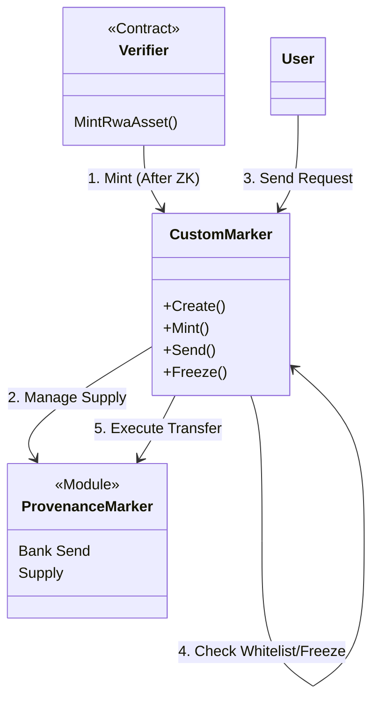

# Contract Analysis: Custom Marker

## Overview
**Type**: Asset Controller
**Crate**: `contracts/custom-marker`
**Description**: The core RWA Compliance engine. It wraps native Provenance Markers to enforce strict whitelist, freeze, and limit rules at the smart contract level before allowing any underlying transfer.

## Key Features
1.  **Sovereign Whitelist**:
    - Maintains a local `WHITELIST` map (Address -> Country Code).
    - independent of the chain's `x/attribute` module.
2.  **Access Control**:
    - `Issuer`, `TransferAgent`, `TokenizationAgent` roles.
    - Role-based gating for `Mint`, `Burn`, `Freeze`.
3.  **Restricted Transfers**:
    - `Send` message acts as a proxy. It checks compliance (`ensure_authorized_country`, `ensure_not_freezed`) *before* executing the native marker transfer.

## Architecture Diagram

## Message Flow Detailed

### 1. `Mint`
- **Auth**: `SubAdmin` / `TokenizationAgent`.
- **Constraint**: Strict role check. Usage intent is for the `Verifier` contract (or Admin) to call this after validating off-chain documents.
- **Action**: Calls `provwasm_std::mint_marker_supply`.

### 2. `Send` (Transfer)
- **Input**: Amount, Denom, To.
- **Logic**:
    1. Check `WHITELIST`: Is `To` allowed?
    2. Check `FREEZE_LIST`: Is `From` or `To` frozen?
    3. Check `DENOM_CONFIG`: Is `To` balance > `token_limit`?
    4. **Execute**: `provwasm_std::transfer_marker_coins`.

### 3. `Freeze`
- **Action**: Adds address to local `FREEZE_LIST`.
- **Effect**: Blocks `Send` and `BurnFrom` operations for that user.

## Dependencies
- `provwasm_std` (Native Bindings).
