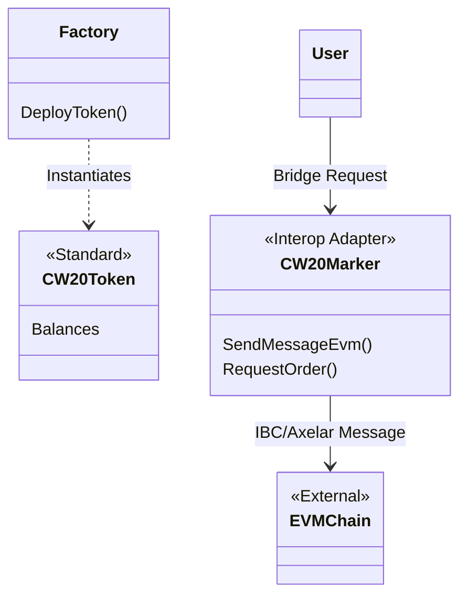

# Contract Analysis: CW20 Wrappers

## 1. CW20 Token Contract
**Type**: Standard Token
**Crate**: `contracts/cw20-token-contract`
**Description**: A vanilla implementation of the `cw20-base` specification.
**Use Case**: Deployed by the `factory` contract to create compliant tokens that live purely in CosmWasm state (as opposed to native Provenance Markers).
**Key Features**:
- Standard `Mint`, `Burn`, `Transfer`.
- Managed by the `Factory` (Admin).

## 2. CW20 Marker
**Type**: Interoperability Adapter
**Crate**: `contracts/cw20-marker`
**Description**: An advanced wrapper designed for cross-chain operations. It seemingly bridges local assets to EVM or other Cosmos chains.

**Key Features**:
1.  **Cross-Chain Messaging**:
    - `SendMessageEvm` / `ReceiveMessageEvm`.
    - `SendMessageCosmos` / `ReceiveMessageCosmos`.
    - Used to bridge assets or data.
2.  **Order Management**:
    - `RequestOrder`: Initiates a cross-chain request.
3.  **DestConfig**:
    - Manages destination chain configurations.

## Architecture Diagram

## Key Differentiation
- **`custom-marker`**: Focuses on **Compliance** (KYC/Freeze).
- **`cw20-marker`**: Focuses on **Interoperability** (Bridging).
- **`cw20-token-contract`**: The raw asset state (if not using native markers).
