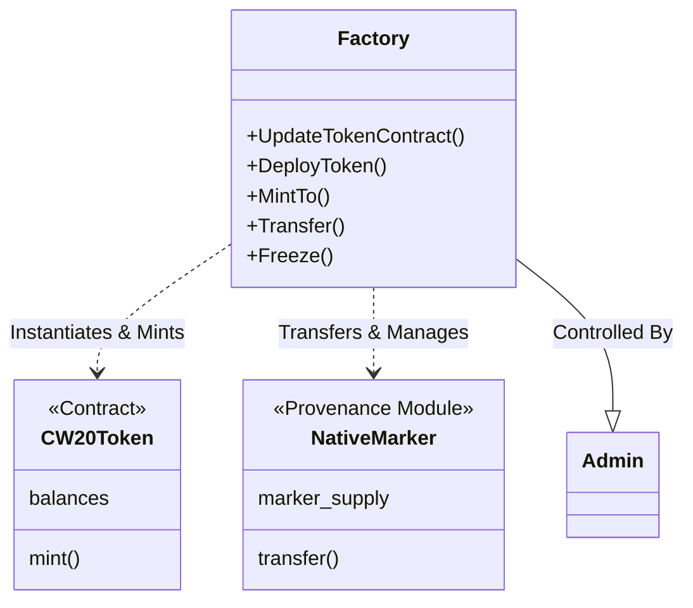

# Contract Analysis: Factory

## Overview
**Type**: Orchestrator / Registry
**Crate**: `contracts/factory`
**Role**: The grand central station of the protocol. It handles the deployment of new assets (specifically CW20 wrappers) and acts as an administrative proxy for managing asset rules (Freezing, Role Management).

## Key Features
1.  **Hybrid Asset Management**:
    - Supports **Native Provenance Markers** (via `Transfer`, `Freeze`).
    - Supports **CW20 Tokens** (via `DeployToken`, `MintTo`).
2.  **Compliance Enforcement**:
    - strict `ensure_authorized_country` and `ensure_not_freezed` checks in the `transfer` logic.
    - Maintains a `FREEZE_LIST` in its own storage.
3.  **Role-Based Access Control (RBAC)**:
    - `Admin` & `SubAdmin` roles.
    - Granular roles: `Issuer`, `TokenizationAgent` delegated to specific assets.

## Architecture Diagram

## Message Flow Detailed

### 1. `DeployToken`
- **Input**: `token_contract::msg::Instantiate` params.
- **Action**: Instantiates a new `cw20-token-contract` wasm contract.
- **Result**: A new CW20 token is live, controlled by the Factory.

### 2. `MintTo`
- **Target**: CW20 Tokens.
- **Auth**: `Issuer` / `TokenizationAgent` / `SubAdmin`.
- **Logic**: 
    1. Checks permissions.
    2. Sends `WasmMsg::Execute(Mint)` to the child `token-contract`.

### 3. `Transfer` (Native Marker)
- **Target**: Provenance Blockchain Markers.
- **Logic**:
    1. **Compliance**: Checks `ensure_authorized_country` (Whitelist).
    2. **Compliance**: Checks `ensure_not_freezed` (Blacklist).
    3. **Execution**: Emits `provwasm_std::transfer_marker_coins`.

### 4. `Freeze` / `PartialFreeze`
- **Target**: Local State (`FREEZE_LIST`).
- **Logic**: specific addresses are added to a denylist stored in the Factory's `deps.storage`. This list is checked during `Transfer`.

## Dependencies
- `custom-marker` (Likely interacts alongside or as a parallel system).
- `cw20-token-contract` (Direct dependency for instantiation).
