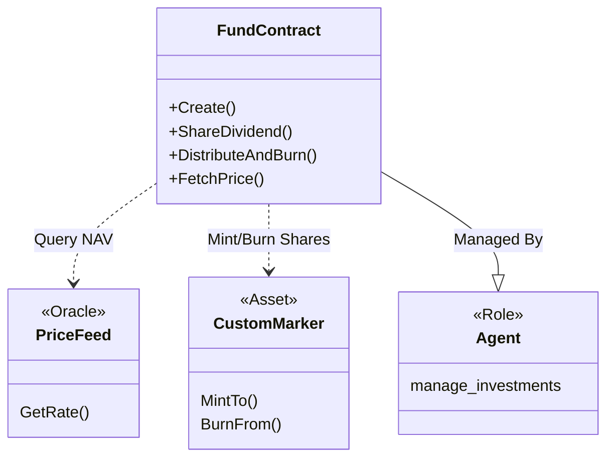

# Contract Analysis: Fund

## Overview
**Type**: Investment Vehicle
**Crate**: `contracts/fund`
**Description**: Managing a privacy-preserving investment fund. It calculates NAV via an external oracle, handles subscription/redemption (Distribute & Burn), and distributes dividends.

## Key Features
1.  **NAV Calculation**:
    - Fetches rates from `price-feed` contract.
    - Updates `GlobalConfig.nav_latest_price`.
2.  **Dividend Distribution**:
    - Supports `Token` (Minting more fund tokens) or `StableCoin` (Bank Send) dividends.
    - Logic handles batching.
3.  **Redemption (`DistributeAndBurn`)**:
    - Atomic swap: Burns Investor's Fund Token + Sends Stablecoins from Agent to Investor.
4.  **Integration**:
    - **Hardcoded Dependencies**: The contract currently points to hardcoded testnet addresses for `MARKER_CONTRACT_ADDRESS` and `ORACLE_CONTRACT_ADDRESS` in `lib.rs`.

## Architecture Diagram

## Message Flow Detailed

### 1. `Create`
- **Action**: Initializes a new Fund.
- **Side Effect**: Sends `ManageRoles` to `custom-marker` to grant itself (`FundContract`) the `Mint/Burn/Transfer/ForceTransfer` roles.
- **Note**: This assumes the `custom-marker` already exists and the caller has authority to grant roles!

### 2. `FetchPrice`
- **Action**: Updates NAV.
- **Flow**: Contract -> `price-feed` (Request) -> `price-feed` (GetRate) -> Update Local State.

### 3. `DistributeAndBurn` (Redemption)
- **Input**: List of Distributions (Investor, Token Amount, Stablecoin Amount).
- **Flow**:
    1.  Call `custom-marker::BurnFrom` (Burn Fund Tokens from Investor).
    2.  Call `Bank::Send` (Send Stablecoins from Agent/Contract to Investor).

## Critical Findings
- **Hardcoded Addresses**: `MARKER_CONTRACT_ADDRESS` and `ORACLE_CONTRACT_ADDRESS` are const strings. This limits deployment flexibility and must be parameterized in `InitMsg` for production.
