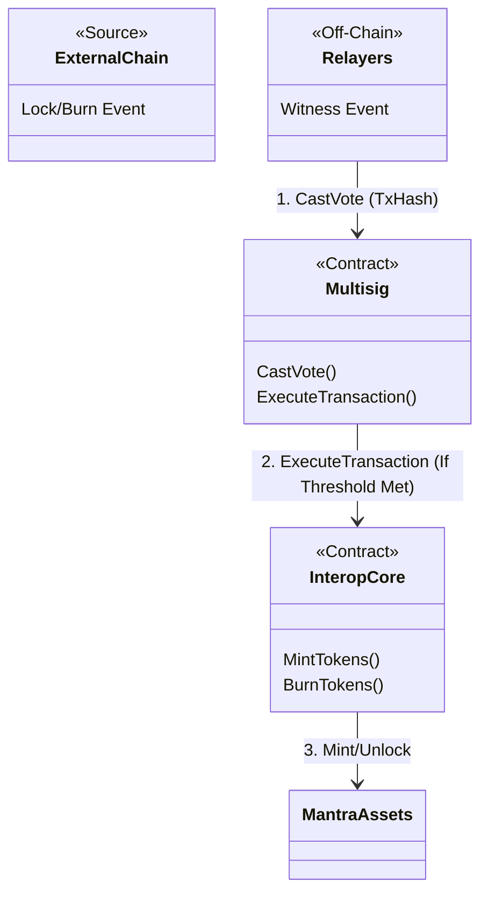

# Contract Analysis: Interop System

## Overview
**Type**: Cross-Chain Bridge
**Description**: A custom bridge implementation relying on a validator multisig to verify cross-chain messages before executing them on Mantra.

## Components

### 1. Interop Multisig (`contracts/interop-multisig`)
**Role**: Governance / Consensus Layer
**Function**:
- Maintains a registry of Validators.
- Collects votes via `CastVote` on specific `tx_hash` (external transaction).
- When `threshold` is reached, it triggers the execution on the Core contract.

### 2. Interop Core (`contracts/interop-core`)
**Role**: Execution Layer
**Function**:
- Receives authenticated instructions from the Multisig.
- Executes:
    - `MintTokens`: Mints assets on Mantra (bridged in).
    - `BurnTokens`: Burns assets on Mantra (bridging out).
    - `SendInstruction`: Emits events/messages for relayers to pick up (outbound).

## Architecture Diagram

## Message Flow Detailed

### Inbound Flow (Bridging In)
1.  **Witness**: Off-chain validators observe a lock/burn event on the Source Chain.
2.  **Vote**: Each validator calls `interop-multisig::CastVote`.
3.  **Consensus**: Once `threshold` votes are caught, the contract (or the last validator) triggers `interop-core::ExecuteInstruction`.
4.  **Execute**: `interop-core` decodes the payload and calls `MintTokens` on the relevant asset contract.

### Outbound Flow (Bridging Out)
1.  **User**: Calls `interop-core::SendInstruction`.
2.  **Action**: Contract burns the local token and emits an Event.
3.  **Relay**: Off-chain validators witness the event and release funds on the external chain.

## Dependencies
- `interop-multisig` depends on `interop-core` (to call it).
- `interop-core` likely depends on `token-contract` or `custom-marker` to mint/burn.
