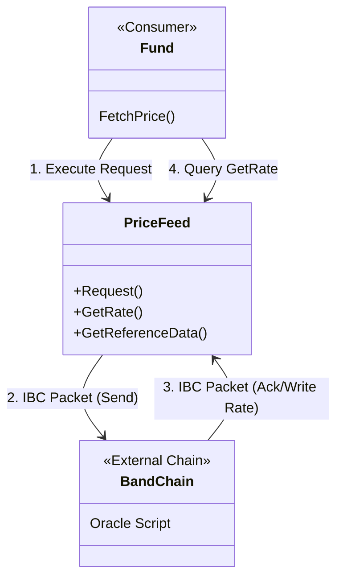

# Contract Analysis: Price Feed

## Overview
**Type**: Oracle Adapter
**Crate**: `contracts/price-feed`
**Description**: Bridges real-world asset prices onto the chain using IBC communication with the Band Protocol.

## Key Features
1.  **IBC Integration**:
    - Uses `cw_band` to format `OracleRequestPacketData`.
    - Sends IBC packets to a relayer/Band Chain.
2.  **Rate Storage**:
    - Stores rates in `RATES` (`Map<&str, Rate>`).
    - Note: The `execute` handler sends the request. The *response* (ACK) which actually updates `RATES` is handled in `ibc.rs` (standard IBC callback pattern).
3.  **Cross-Rate Calculation**:
    - `GetReferenceData` derives rates (e.g., BTC/EUR) from base USD rates if needed.

## Architecture Diagram

## Message Flow Detailed

### 1. `Request`
- **Input**: List of Symbols (e.g., ["BTC", "ETH"]).
- **Action**: Constructs an IBC packet with `ask_count`, `min_count`, `fee_limit`.
- **Outcome**: Packet sent. The transaction finishes. The data is *not* available yet (asynchronous).

### 2. `GetRate` (Query)
- **Input**: Symbol.
- **Output**: Rate, Resolve Time, Request ID.
- **Logic**: Returns data from local `RATES` storage. This storage is populated only *after* the IBC packet is acknowledged.

## Dependencies
- `cw-band` (Crate).
- Relayer infrastructure for IBC.
