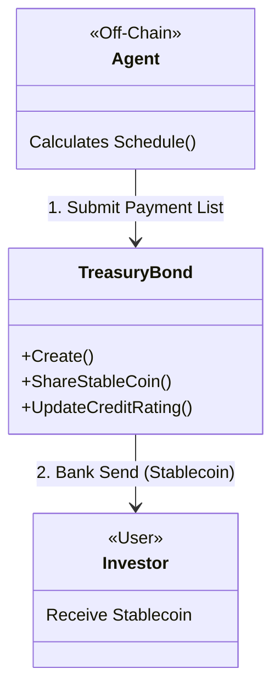

# Contract Analysis: Treasury Bond

## Overview
**Type**: Debt Admin / Distribution Contract
**Crate**: `contracts/treasury-bond`
**Description**: Facilitates the management of bond lifecycle events, primarily the distribution of coupons (stablecoins) and tracking of credit ratings.

## Key Features
1.  **Coupon Distribution (`ShareStableCoin`)**:
    - **Mechanism**: Push-based. The Agent submits a list of `(Address, Amount)` pairs.
    - **Action**: The contract sends Stablecoins from its balance (Agent must fund it first or it holds funds) to the recipients.
    - **Note**: It does *not* automatically calculate coupons based on token holdings. The schedule and calculation happen off-chain.
2.  **Credit Rating**:
    - Stores simple string ratings (`UpdateCreditRating`).
3.  **Role Management**:
    - `Admin` (Protocol Level) vs `Agent` (Bond Issuer/Manager).

## Architecture Diagram

## Message Flow Detailed

### 1. `Create`
- **Action**: Sets up the bond config (`target_aum`, `ccy`, etc.).
- **State**: Saves `GLOBAL_CONFIG`.

### 2. `ShareStableCoin`
- **Input**: `Vec<ShareParams>` (Address, PaymentAmount).
- **Auth**: `Agent` only.
- **Logic**:
    1. Iterates through recipients.
    2. Constructs `BankMsg::Send` for each.
    3. Updates `PAYMENTS` history (local state).
    4. **Risk**: High gas usage if the list is long (O(N) Bank Sends).

## Critical Findings
- **Passive Contract**: This contract is essentially a "payroll" system. It relies entirely on the Agent to determine *who* gets paid and *how much*. It does not query the Bond Token balance to calculate pro-rata shares strictly on-chain.
