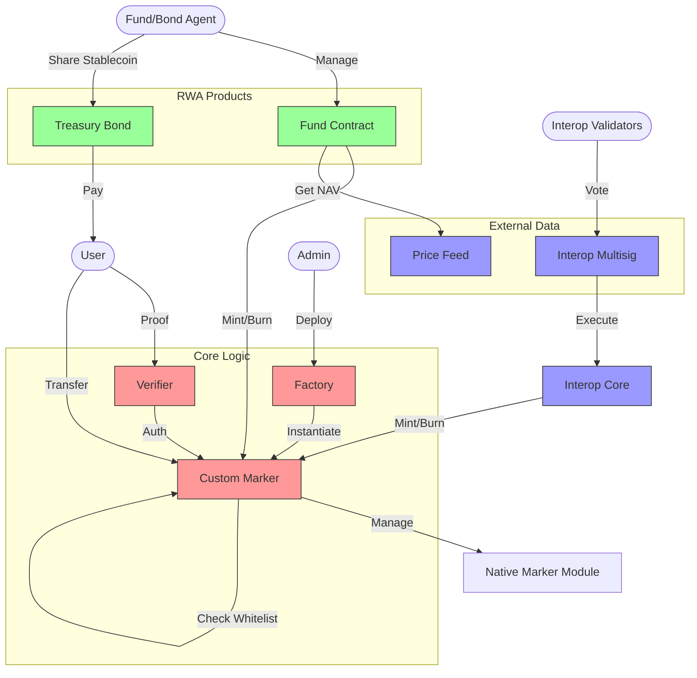

# Mantra RWA Compliance: Master System Architecture

## Executive Summary
The **Mantra RWA Compliance** repository implements a sophisticated framework for Real-World Asset (RWA) tokenization on the Mantra Chain (Cosmos SDK). It moves beyond simple token standards by integrating **Chain-Sovereign Compliance** (Whitelist/Freeze) directly into the asset lifecycle, supported by a modular ecosystem of investment vehicles (Funds), debt instruments (Bonds), and cross-chain interoperability.

## Module Map

| Module | Type | Role | Key Dependencies |
| :--- | :--- | :--- | :--- |
| **`factory`** | Core | Orchestrator. Deploys tokens, manages global roles. | `token-contract` |
| **`custom-marker`** | Core | Asset Control. Enforces Whitelist/Freeze rules on Native Markers. | `provwasm_std` |
| **`verifier`** | Core | Compliance Gateway. Validates ZK proofs to authorize minting. | `custom-marker` |
| **`fund`** | Product | Investment Vehicle. Manages NAV, Dividends, Redemptions. | `price-feed`, `custom-marker` |
| **`treasury-bond`** | Product | Debt Instrument. Distributes stablecoin coupons. | Off-chain Agent |
| **`price-feed`** | Infra | Oracle. IBC Adapter for Band Protocol. | `cw-band` |
| **`interop-core`** | Infra | Bridge. Executes cross-chain mints/burns. | `interop-multisig` |
| **`cw20-wrappers`** | Infra | Token Adapters. Standard CW20 and Cross-chain messaging. | `cw20-base` |

## Comprehensive Data Flow

## Detailed Connectivity

### 1. The Asset Core (`custom-marker`)
This is the heart of the system. Unlike standard ERC20s where `transfer` is simple, here every interaction is mediated by `custom-marker` which checks:
1.  **Identity**: Is the receiver in a permitted country? (`WHITELIST`)
2.  **Status**: Is the sender/receiver frozen? (`FREEZE_LIST`)
3.  **Limits**: Are flow limits respected?

### 2. The Orchestrator (`factory`)
The `factory` ensures that all assets are created with the correct parameters and permissions. It acts as the "Parent" to `cw20` tokens and potentially `custom-marker` deployments, maintaining a registry of what exists on-chain.

### 3. The Investment Layer (`fund` & `treasury-bond`)
These contracts sit *on top* of the Asset Core.
- **Fund**: Active management. It mints/burns the Asset Core tokens to represent shares. It relies on `price-feed` to calculate how much to mint (NAV).
- **Bond**: Passive management. It assumes the Asset Core tokens (the bond security) exist, and focuses purely on distributing *yield* (stablecoins) to the holders of those tokens.

### 4. The Bridge (`interop`)
A sovereign bridge. It allows Mantra RWAs to be ported to/from other chains. It bypasses standard minting rules by having `Mint` authority granted to it by the `Factory` or `Admin`.

## Conclusion
The architecture is designed for **Regulated DeFi**. It sacrifices some permissionless attributes (adding mandatory whitelist checks) to ensure compliance with real-world financial regulations, while utilizing the speed and composability of CosmWasm.
